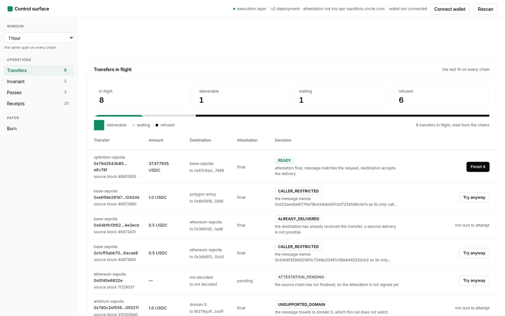
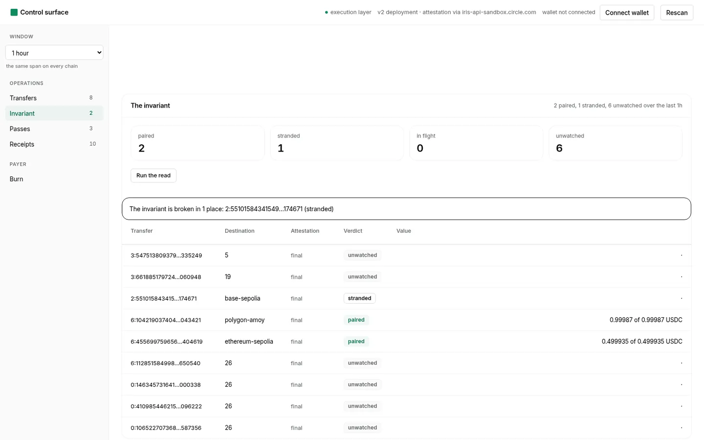
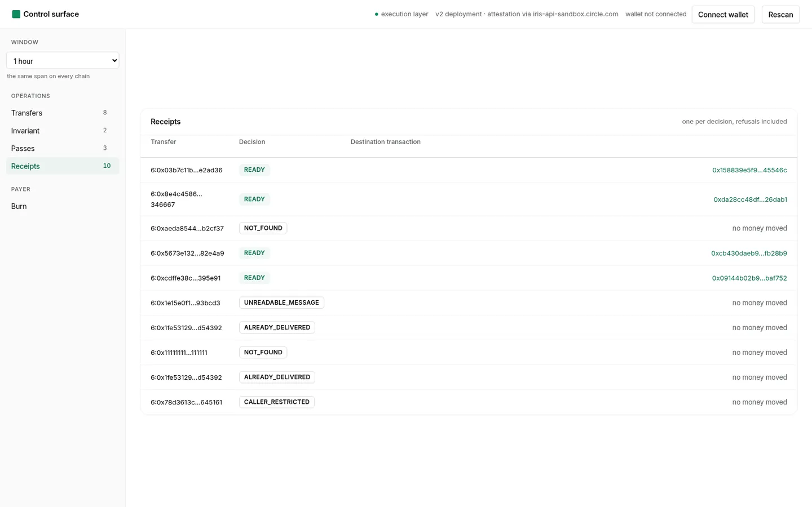

<div align="center">

# ASTRA

### One burn, exactly one mint.

A cross-chain transfer leaves one chain and arrives on another, unless it does not. ASTRA watches both
ends, finishes what is in flight through an execution layer that holds the keys, and refuses, by name,
what may not move.

[](https://youtu.be/PuOpOkQNzcI)
[](https://astra-rail.vercel.app)
[](astra/config.py)
[](tests/)
[](scripts/prove_pairing.py)
[](LICENSE)

<a href="https://youtu.be/PuOpOkQNzcI"></a>

</div>

---

## Watch the demo

**[youtu.be/PuOpOkQNzcI](https://youtu.be/PuOpOkQNzcI)** — 2m22, recorded on the live instance, browser
only, nothing typed in a terminal. In order: a transfer read and answered without spending anything, a
refusal that names its reason and offers no button for it, a delivery **broadcast through the execution
layer while it runs**, and the invariant measured from both chains. The mint that happens in the video is
[`0xbe536f01…`](https://sepolia.etherscan.io/tx/0xbe536f012f507f9e5b5b7d4e28e1efb921538c72f38883ae37d45e4744f9bac2)
on Ethereum Sepolia, and it is in the live ledger at
[`/api/receipts`](https://astra-rail.vercel.app/api/receipts).

**Jump to:** [Live](#live) · [The gap](#the-gap-in-one-paragraph) · [The invariant](#the-invariant) ·
[Refusals](#refusals-have-names) · [The surface](#the-control-surface) · [Evidence](#evidence-on-the-chains) ·
[Run it](#run-it) · [Limits](#limitations-and-roadmap)

## Table of contents

- [Live](#live)
- [The gap in one paragraph](#the-gap-in-one-paragraph)
- [The invariant](#the-invariant)
- [Refusals have names](#refusals-have-names)
- [The control surface](#the-control-surface)
- [How it executes](#how-it-executes)
- [Five chains, two deployments, one rail](#five-chains-two-deployments-one-rail)
- [Evidence, on the chains](#evidence-on-the-chains)
- [Layout](#layout)
- [Run it](#run-it)
- [Deploying it](#deploying-it)
- [Limitations and roadmap](#limitations-and-roadmap)

## Live

**https://astra-rail.vercel.app** — the same surface, hosted, reading the same five testnets.

It is read-only by design and says so on the page: a hosted bundle holds no key, so nothing there signs
a burn. Value still moves through it — the rail finishes transfers that are in flight, including ones
somebody else made — and creating a transfer there is signed in the visitor's own wallet. The receipts
below were written by local runs and by the hosted instance, and the page shows both.

| Through the deployment | |
|---|---|
| A transfer opened locally, finished by the hosted rail | burn [`0x969353ce…`](https://sepolia.basescan.org/tx/0x969353cef2a024279464103f3cd804ed77559997ec7daf729edd606fd7b35f6f) → mint [`0x01aebb10…`](https://sepolia.etherscan.io/tx/0x01aebb103acd93a992e6f0744f7d2bad9a4584e54e7fcb487fb00e56d312a6eb) |
| Its mint measured from the token's own transfer event | 0.049994 of 0.049994 USDC, 20 seconds after the request |
| A transfer opened for the recording, finished during the recording | burn [`0x0b5f20c8…`](https://sepolia.basescan.org/tx/0x0b5f20c8b9d2f6972cff701708246638ff32bcf928a50bbcbbd534356c1cbcc8) → mint [`0xbe536f01…`](https://sepolia.etherscan.io/tx/0xbe536f012f507f9e5b5b7d4e28e1efb921538c72f38883ae37d45e4744f9bac2) |

## The gap in one paragraph

Moving value between two chains is two transactions, not one. The first burns on the source chain and
announces a message. The second hands a signed attestation to the destination contract, which mints.
Between them the value exists nowhere spendable: it has left the source and it has not arrived. That
window closes only if somebody is watching both ends. A rail that watches one end cannot tell a transfer
that has arrived from one that is stuck, and a rail that keeps its own list cannot tell that somebody
else already delivered the transfer it is about to send.

## The invariant

    One burn, exactly one mint.

For every message the source chain announced, the destination chain received it once, or it has not
received it yet, and there is no third possibility. `scripts/prove_pairing.py` reads both chains and says
which happened, per transfer, including how much value arrived:

    transfer                     amount  destination        attestation verdict
    6:931762504361313534443157 0.050000  ethereum-sepolia   final      paired  mint 0x09144b02b95f  minted 0.049994 of 0.049994
    6:546510176608399233227111 1.000000  ethereum-sepolia   final      stranded
    2:179291946512626312961173 1.000000  26                 final      unwatched
    ...
    1 paired, 1 stranded, 10 unwatched

Delivery is read from the destination's own receipt event, keyed by the source domain and the nonce that
event carries — the same statement on both live deployments, which is why the older one can be paired
here even though its storage does not answer the newer contract's replay question.

The invariant can break in three ways, and all three are checked:

    stranded        the attestation is signed and nothing has received it: value that could move
    received twice  the destination named the same nonce twice: value that moved twice
    short           the mint is less than the burn, by more than the protocol's own fee

It exits non-zero on any of them, so wiring it to a job makes "money is stuck" a failed job rather than a
paragraph. `scripts/astra_watch.py` is that job: it runs the same pass on an interval and writes one
journal entry per pass, and it does not spend anything. The control surface shows the same read —
counters, each paired row's measured value, the places it is broken, and the journal of scheduled
passes — so the invariant is visible without a terminal. Finishing a transfer stays an explicit act on
purpose: a process that moves money unattended is the thing this rail exists to replace with something
you can ask about.

## Refusals have names

The refusal is the product. Every one carries a reason code and the evidence that produced it, and the
surface only offers an action when the protocol has not already ruled it out — a refusal read from the
destination's own state renders **not ours to attempt**, with no button to press.

| Reason | Meaning | Read from |
|---|---|---|
| `ALREADY_DELIVERED` | the destination already holds this transfer | the destination contract's record for the nonce |
| `CALLER_RESTRICTED` | the message names one allowed caller and it is not the executor | the message's `destinationCaller` |
| `ATTESTATION_PENDING` | the source has not finalised, so nothing is signed yet | the attestation service |
| `RECIPIENT_MISMATCH` / `AMOUNT_MISMATCH` / `TOKEN_MISMATCH` | the request does not describe the transfer in the message | the message body |
| `ROUTE_MISMATCH` | the message travels between other domains than the caller named | the message header |
| `MESSAGE_INCONSISTENT` | our decode and the service's decode of the same bytes disagree | two decodes |
| `WRONG_TRANSMITTER` | the contract about to be called serves another domain | an on-chain read |
| `UNSUPPORTED_DOMAIN` | the transfer goes somewhere this rail does not watch | rail configuration |
| `DEPLOYMENT_ABSENT` | the rail watches the chain, but this deployment is not on it | rail configuration |
| `PREFLIGHT_REVERT` | the destination would reject the delivery for another reason | the destination's simulation |
| `UNREADABLE_MESSAGE` | the message body could not be decoded, so nothing is attempted | our decoder |

Each of these was produced against the live destination, not constructed for a test:

| Refusal | How it was produced |
|---|---|
| `ALREADY_DELIVERED` | the same completed transfer asked twice; the destination contract reports the nonce as used |
| `CALLER_RESTRICTED` | a transfer whose message names a single allowed caller; the rail names that address and does not attempt |
| `NOT_FOUND` | a source transaction with no transfer behind it |
| `RECIPIENT_MISMATCH` | a request naming a recipient the message does not carry |
| `ATTESTATION_PENDING` | a transfer read before the source chain finalised; the rail defers and waits |
| `UNSUPPORTED_DOMAIN` | a transfer travelling to a chain this rail does not serve, named rather than attempted |

## The control surface

The rail's whole state, read from the chains on demand — no indexer is asked what is pending, and nothing
this rail wrote down is consulted.

**Transfers in flight.** Every transfer the source logs announced, each with a verdict, the evidence
behind it, and at most one action. The number row is a total and the three parts of it, drawn as a bar
from the same numbers; the rail on the left carries the live counts.



**The invariant.** The same read `prove_pairing.py` makes, per transfer, with the value that arrived
measured against the value that left.



**Receipts.** One per decision — deliveries and refusals alike — each carrying what was seen, what was
decided, and what moved.



## How it executes

The rail holds no key and signs nothing itself. Every state-changing call goes through an execution
layer: simulate first, read the verdict, broadcast with an idempotency key derived from the transfer,
then poll until the transaction hash appears. The destination's simulation is not decoration — it is
where the already-delivered refusal comes from, before anything is spent.

The payer side stays in the wallet of whoever is paying. Creating a transfer is their transaction: they
approve and they burn from their own address, and the message names them as the recipient. The surface
does both halves: from the key this machine holds (the panel reports what that address holds on each
chain and offers only the chains it can actually pay on) or from a browser wallet.

## Five chains, two deployments, one rail

    domain 0  ethereum-sepolia   11155111
    domain 2  optimism-sepolia   11155420
    domain 3  arbitrum-sepolia   421614
    domain 6  base-sepolia       84532
    domain 7  polygon-amoy       80002

Every one of those is a chain the execution layer can deliver on and the protocol is deployed on; the
addresses are in `astra/config.py`, and each destination contract is asked for the domain it serves
before it is called. A chain that this particular deployment is not on is refused with
`DEPLOYMENT_ABSENT` instead of being attempted and failing.

Two versions of the protocol are live at once. The later one accepts a fee cap and a finality threshold,
so a transfer can be attested as soon as the source block is confirmed; the earlier one waits for full
finality. **Both message layouts are decoded field by field** — the offsets were derived from real
messages and then cross-checked against the messenger's own deposit event on the source chain, and the
test suite pins each layout against two real transfers.

## Evidence, on the chains

Everything below was produced by this repository against public testnets. Links are to the chains
themselves, not to this project.

| What | Where | Transaction |
|---|---|---|
| A transfer opened and left in flight | Base Sepolia (84532) | [`0x6c7fa66b…65d108`](https://sepolia.basescan.org/tx/0x6c7fa66b54ba1608f144d72b403ce4a3d1d07bb4da82ed27c14f3dbfca65d108) |
| **That transfer finished, executed by the execution layer** | Ethereum Sepolia (11155111) | [`0x596e00b4…aa64a45`](https://sepolia.etherscan.io/tx/0x596e00b4b14c99a95572bc53a2e8b48ac10aff48f4e4c5e62f6dda855aa64a45) |
| A transfer opened against the older deployment | Base Sepolia | [`0x1e15e0f1…93bcd3`](https://sepolia.basescan.org/tx/0x1e15e0f18046f3db2f8f4cd9bfd43f72b3f569b6948748c54697898a5293bcd3) |
| **It finished too, through the same rail** | Ethereum Sepolia | [`0xa1aecdf9…8e209d`](https://sepolia.etherscan.io/tx/0xa1aecdf992c02913491df02c36b6d3291a20c6d68b03feb0f545e7c4978e209d) |
| 0.05 USDC opened on the fast threshold, left in flight | Base Sepolia | [`0x9a616524…9ce5da`](https://sepolia.basescan.org/tx/0x9a616524a0a707c3a0cb7347e0ca7bb186bf72acc7db64cd040cf25a829ce5da) |
| **Finished by the rail, and the mint measured** | Ethereum Sepolia | [`0x09144b02…5baf752`](https://sepolia.etherscan.io/tx/0x09144b02b95fcb419a81feed42432fe9a9fcfd9d2e4152ea3c346e4095baf752) |
| 0.05 USDC opened once more, after the rail was widened to five chains | Base Sepolia | [`0x27e417c4…fc6168`](https://sepolia.basescan.org/tx/0x27e417c44a724686ee48f0b9a5817ad844536f29e8e09adc9ab9c0402afc6168) |
| **Finished by the rail on the same path: 0.049994 minted of 0.050000 burned** | Ethereum Sepolia | [`0xcb430dae…fb28b9`](https://sepolia.etherscan.io/tx/0xcb430daeb90c12aedd639c4463cf5d951abfcd5d49680bf32d84a93e6afb28b9) |
| A transfer created **from the web page in one click**, no wallet involved | Base Sepolia | [`0x197ea313…fe4406`](https://sepolia.basescan.org/tx/0x197ea31303de2dee21eb3ef31c175914bd508146482d4b5ddf43a98a47fe4406) |
| **Finished by the same click, 40 seconds later** | Ethereum Sepolia | [`0x158839e5…545546c`](https://sepolia.etherscan.io/tx/0x158839e5f9692ce74fa481e2fb04ea30e1e3c2060a673aeab79513f33545546c) |
| A transfer whose message names another caller, left undelivered on purpose | Base Sepolia | [`0xd517d29c…38d793`](https://sepolia.basescan.org/tx/0xd517d29c6466b55d63abf2b717f647ca847cb19ae3959c2cfaa0d3537e38d793) |
| Testnet gas sent to the wallet that executes | Ethereum Sepolia | [`0xc2a660c4…8a44db`](https://sepolia.etherscan.io/tx/0xc2a660c4290550050d784bcfa195988d41fa64361cf03912148ccbdb408a44db) |

Every delivery settles to the protocol's own arithmetic: 0.050000 USDC burned, a 0.000006 fee for the
fast threshold, 0.049994 minted — and the rail reads the minted figure out of the token's own transfer
event rather than assuming it, so `prove_pairing.py` reports the pair as `minted 0.049994 of 0.049994`
for each one.

## Layout

    astra/config.py          chains, domains, contract addresses, environment
    astra/protocol.py        the wire format: both live layouts, corroborated against a second decode
    astra/attestation.py     the attestation service: pending, final, not found
    astra/keeperhub.py       the execution layer: simulate, broadcast, poll, idempotency
    astra/classifier.py      when money may move, as a pure function
    astra/rail.py            one pass over one transfer: observe, decide, act, record
    astra/inflight.py        discovery: the source log stream, the destination's verdict
    astra/pairing.py         the invariant: a verdict per transfer, and the three ways it breaks
    astra/payer.py           the paying side: approve, burn, and nothing else
    astra/rpc.py             a read-only JSON-RPC client
    scripts/                 the payer side, discovery, completion, the invariant, the watcher
    service/                 the HTTP surface and the browser control surface
    api/index.py             the hosted entry point: the same surface, read-only, no key
    vercel.json              the deployment: one function for every route, 60s, bundle includes
    tests/                   68 tests, including the captured messages this project produced

## Run it

```bash
cp .env.example .env          # fill in the executor key and the payer wallet
uv venv .venv && uv pip install --python .venv/bin/python pytest   # 68 tests
.venv/bin/python -m pytest tests -q

.venv/bin/python scripts/astra_inflight.py --blocks 4000
.venv/bin/python scripts/astra_open_transfer.py --amount 1              # your wallet signs this
.venv/bin/python scripts/astra_complete.py --burn-tx 0x… --source 6 --destination 0 --wait 300
.venv/bin/python scripts/prove_pairing.py --blocks 4000                 # exits non-zero if broken
.venv/bin/python scripts/astra_watch.py --once --blocks 2000            # one pass, one journal entry

.venv/bin/python service/astra_service.py --port 8099                   # open http://127.0.0.1:8099
```

Evidence the runs leave behind, all committed:

- `artifacts/receipts/` — one receipt per decision, including the refusals, each carrying the evidence
- `artifacts/pairing.json` — the invariant's answer for a window of transfers, with amounts measured
- `artifacts/watch/` — the journal of scheduled passes
- `artifacts/spike-burn.json`, `artifacts/spike-burn-v2.json` — the raw attestations and executions
- `tests/fixtures/captured.json` — messages captured from the transfers above, pinned by the tests
- `.github/workflows/tests.yml` — the suite, a check that no key material is tracked, and a check that
  the package imports with no configuration at all

## Deploying it

The repository ships the deployment. `api/index.py` is the hosted entry point: it sets the instance
read-only, points receipts at a writable directory, and hands every route to the same service the local
run uses, so a bug found locally is a bug here. `vercel.json` sends everything to that function and
includes the package, the service and the committed artifacts in the bundle.

    vercel link --project astra
    printf '%s' "$KH_API_KEY" | vercel env add KH_API_KEY production
    vercel deploy --prod --yes
    vercel alias set <the deployment URL that was just printed> astra-rail.vercel.app

That last line matters: a manual alias pins one deployment, so it has to be re-pointed after every
production deploy or the pretty URL keeps serving the previous build. Verify by grepping the served HTML
for something only the new build has, not by status code.

Three environment variables are all it needs: the execution layer's key, the attestation base, and
`ASTRA_READ_ONLY=1`. No paying key is set there, which is why the page tells a visitor to sign the burn
in their own wallet — and why an endpoint anyone can reach can spend the executor's gas only six times in
ten minutes.

## Limitations and roadmap

Read [docs/LIMITATIONS.md](docs/LIMITATIONS.md) before trusting this with anything. The short version: it
is a testnet rail, it watches five chains, it decodes both live message layouts, and it holds no key.
What it does not do, it refuses by name rather than approximating.

Roadmap: mainnet configuration, domains beyond the ones the execution layer can currently reach, and a
hosted read-only surface so the pairing proof can be watched without running anything.

---

MIT. See [LICENSE](LICENSE).
